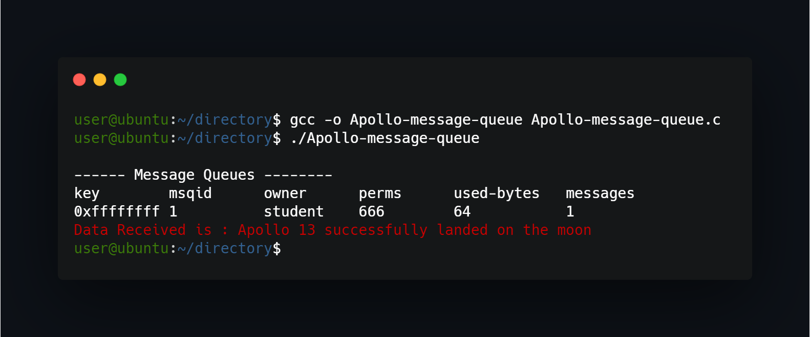

## What project do?
Program uses message queue to display message.



## How to use?
Just compile and run:
```
gcc -o Apollo-message-queue Apollo-message-queue.c
./Apollo-message-queue
```


<!--https://banner.godori.dev/ height:150-->
<!--https://shields.io/-->
<!--https://carbon.now.sh/-->